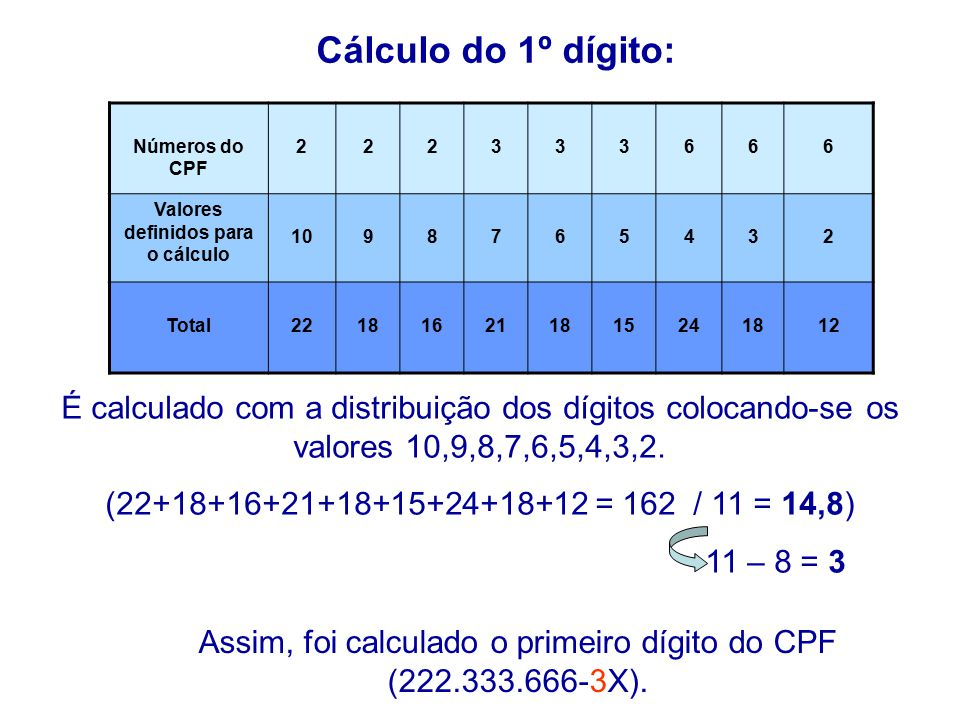
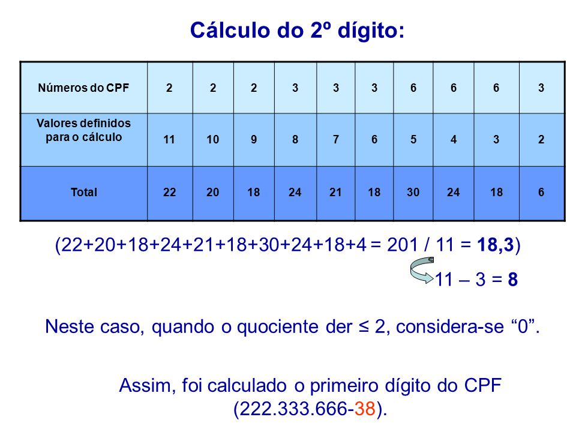

# Validador de CPF v.1.0.0

**Esta biblioteca se destina à fazer a verificação dos dados do CPF para uso em aplicações web.**
Na versão atual é capaz de verificar se o número do CPF é valido ou não.
O CPF(Cadastro de Pessoa Física)  é um documento brasileiro emitido pela Secretaria da Receita Federal do Ministério da Fazenda. Seu número é composto por 11 dígitos, sendo os dois últimos os dígitos verificadores, que atestam se o número do CPF é válido. 

## Índice

* [Ferramentas Utilizadas](#Ferramentas-Utilizadas)
* [Como Instalar](#Como-Instalar)
* [Como Utilizar](#Como-Utilizar)
* [Para Desenvolvedores](#Para-Desenvolvedores)
* [Roadmap oficial do projeto](#Roadmap-oficial-do-projeto)
* [Cálculo para verificar o número do CPF](#Cálculo-para-verificar-o-número-do-CPF)
* [Objetivo deste Projeto](#Objetivo-deste-Projeto)

## Ferramentas Utilizadas
Para esta biblioteca foram utilizados Javascript, Node.JS, Mocha, Chai e Nyc.
E também foi utilizado o Eslint para encontrar padrões problemáticos ou códigos que não seguem determinadas diretrizes de estilo.

## Como Instalar:

```shell

$  npm install cpf-validator-new

ou 

$  sudo npm install cpf-validator-new

```

## Como Utilizar com o Node.js já instalado:
Abra o terminal na pasta em que a biblioteca já está instalada e digite os comandos:
```node
> node
> const CPF = require('cpf-validator-new');
> CPF.cpfValidator('04114512608'))

> sudo npm test

```
Dentro dessa função CPF.cpfValidator('*numero do CPF*') você pode digitar outro número de CPF para saber se é um número válido ou não.


## Para Desenvolvedores:
Caso você esteja querendo entender como funciona a biblioteca e quer fazer testes, é necessário instalar as ferramentas necessárias. Segue o passo-a-passo de uma das formas que você pode fazer seus testes:
Abra o seu terminal, seguindo os passos abaixo você vai criar uma pasta nova e vai instalar o que for necessário:

```node
> mkdir pastaValidadorCpf

> cd pastaValidadorCpf

> npm init
(nesse passo de cima ele cria automático um novo projeto com o arquivo package.json, depois vai ser requerido algumas informações que é necessário preencher)

> npm install cpf-validator-new (que é para instalar a biblioteca)

> npm install (para instalar o que for necessário para poder trabalhar na biblioteca)

Dentro dessa pasta cria um arquivo echo > index.js (pode ser com o nome que você desejar)

> code .

Dentro dessa pasta cria um arquivo echo > index.js (pode ser com o nome index.js)
> code . (para abrir o arquivo com o visual studio. Ou caso use outro editor, abra o arquivo nesse editor)
E cole os comandos: 
> const CPF = require('./node_modules/cpf-validator-new/lib/index.js');
> CPF.cpfValidator('87474718677')

```
Dentro dessa função CPF.cpfValidator('*número do CPF*') você pode digitar o número de outro CPF para saber se é um número válido ou não.

E para testar a função da biblioteca abra o terminal nessa pasta e digite: 
node index.js

Caso seja um cpf válido ele deve retornar true, senão ele retorna false.

## Roadmap oficial do projeto
### versão 1.0.0 (released)
- Funcionalidades: Verificação se número de CPF é válido ou não.
- Essa biblioteca também faz a verificação se o CPF está com ponto, hífen ou espaço, e corrige caso esteja com algum desses caracteres.
- Verifica se a quantidade de números está correta.  
- Verifica se os dígitos não estão repetidos.
- Verifica se foi digitado apenas letras ou o campo está vazio.
- Verifica se o tipo do campo é numérico, e caso seja retorna um erro. Pois só é aceito números do tipo string porque o cpf pode vir de diferentes formas.

## Cálculo para verificar o número do CPF
Os últimos dois números do CPF que comprovam se esse é um número válido ou não. Para isso é necessário fazer o cálculo em duas partes.

### Calculando o Primeiro Dígito Verificador
1. O primeiro dígito verificador do CPF é calculado baseando-se no seguinte algoritmo. 

* Vamos supor que o número do CPF é: 222.333.666-38

* Distribua os 9 primeiros dígitos do CPF na primeira linha de uma tabela, e na linha abaixo distribua os pesos 10, 9, 8, 7, 6, 5, 4, 3, 2

* Multiplique os valores de cada coluna

* Calcule a somatória dos resultados

* O resultado obtido (162) será divido por 11. Considere como quociente apenas o valor inteiro obtido na divisão, o **resto** da divisão que será o responsável pelo cálculo do primeiro dígito verificador.
*Caso o resto for menor que 2, o dígito verificador é zero. Senão você deve subtrair o resto encontrado de onze.
No nosso caso o resto da divisão é 8. Então temos que subtrair **11 - 8 = 3**.

A primeira parte da conta terminamos, agora vamos para a segunda parte.

### Calculando o Segundo Dígito Verificador
1. Para calcular o segundo dígito verificador, fazemos o cálculo de forma análoga ao primeiro dígito, acrescentando ao CPF o dígito encontrado no passo anterior. Na segunda linha, os pesos são distribuídos começando por 11.

* Faça a somatória da multiplicação das colunas.

* Encontre o resto da divisão da somatória por 11.

* O resto da divisão é 3. Para calcular o dígito verificador, você deve subtrair o resto encontrado de onze.

**11 – 3 = 8**

* Como o resultado da subtração não é menor que 2, o resultado é o próprio dígito verificador.

* Agora já sabemos quais são os dois dígitos verificadores válidos, 0 e 9, podemos afirmar que o CPF hipotético usado no exemplo é válido.

222.333.666-38 (CPF válido)
123.456.789-10 (CPF inválido)

## Objetivo deste Projeto
Construir uma biblioteca que atenda aos requisitos abaixo:
**README.md** com descrição do módulo, instruções de instalação, uso e documentação da API.

**index.js:** Biblioteca deve exportar uma função e fazer uso de features de ES6 onde for apropriado.
package.json com nome, versão, descrição, autores, licença, dependências, scripts (pretest, test, ...)
.eslintrc com configuração para linter (ver guia de estilo de JavaScript)

**test/index.spec.js:** com as rotinas de teste escritas para esta biblioteca. Os testes devem ser implementados com Mocha e NYC

**.gitignore**para ignorar node_modules ou outras pastas que não devem ser incluídas no controle de versões (git).

Fazer uso do **TDD (Test Driven Development)** onde seu principal objetivo é criar testes antes de desenvolver determinado código, visando o mínimo de código possível. Os testes passando se faz necessário refatorar até satisfazer o objetivo final que é criar códigos mais limpos, testáveis e reduzir o máximo de probabilidade de erros no código. 
